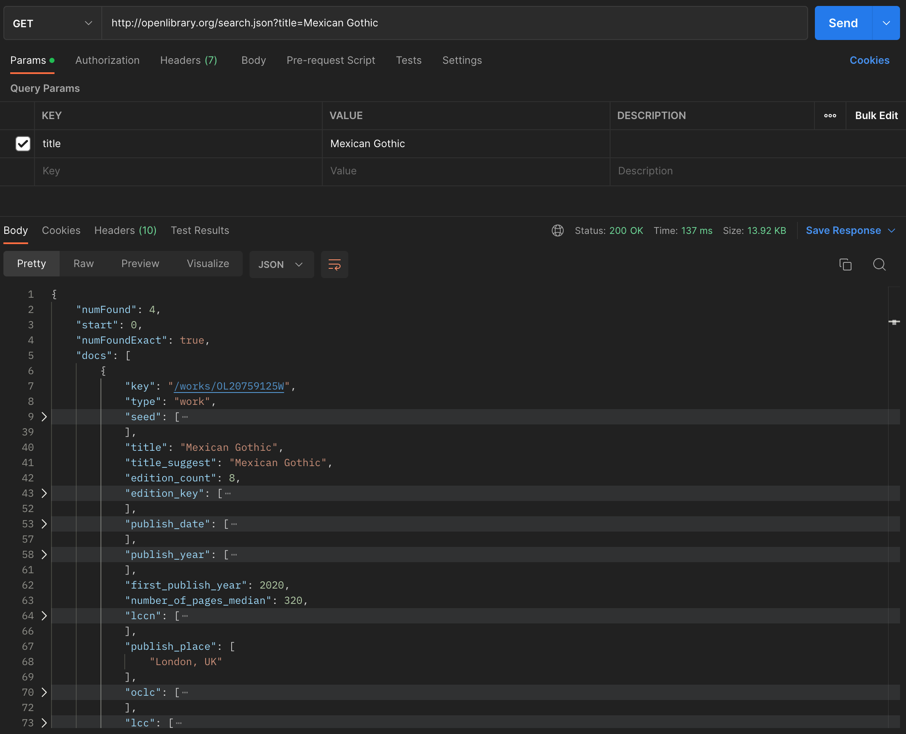
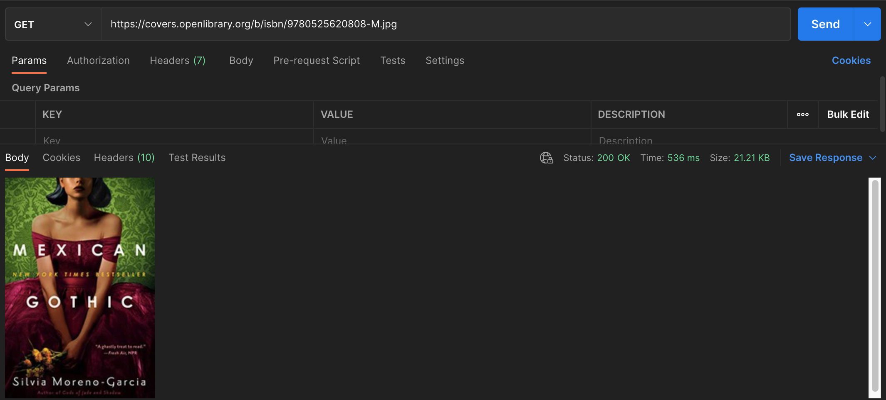
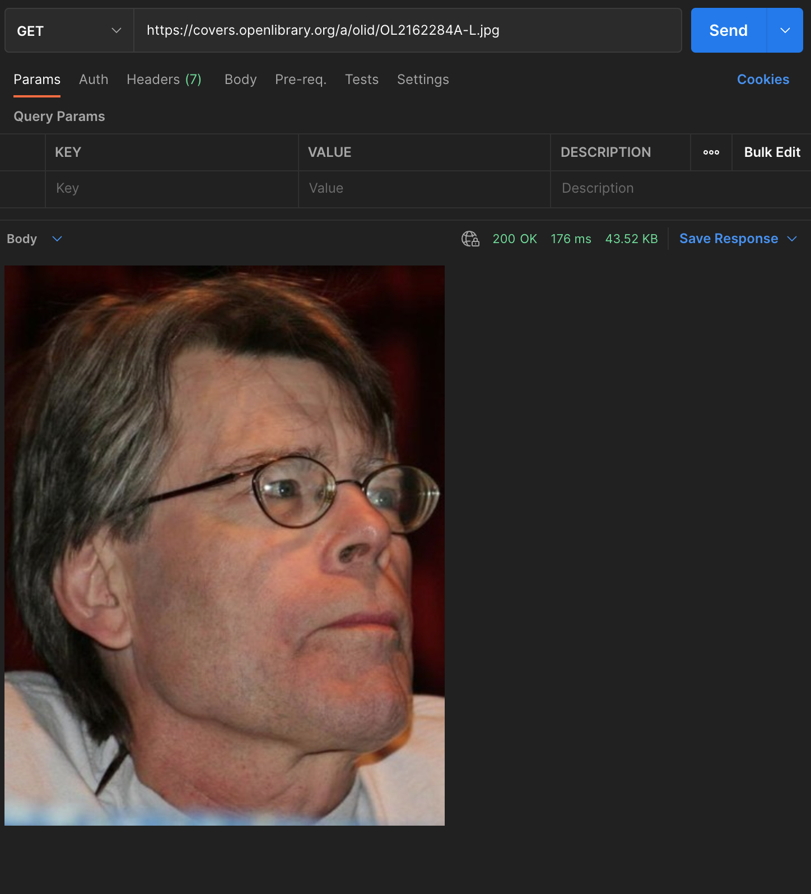
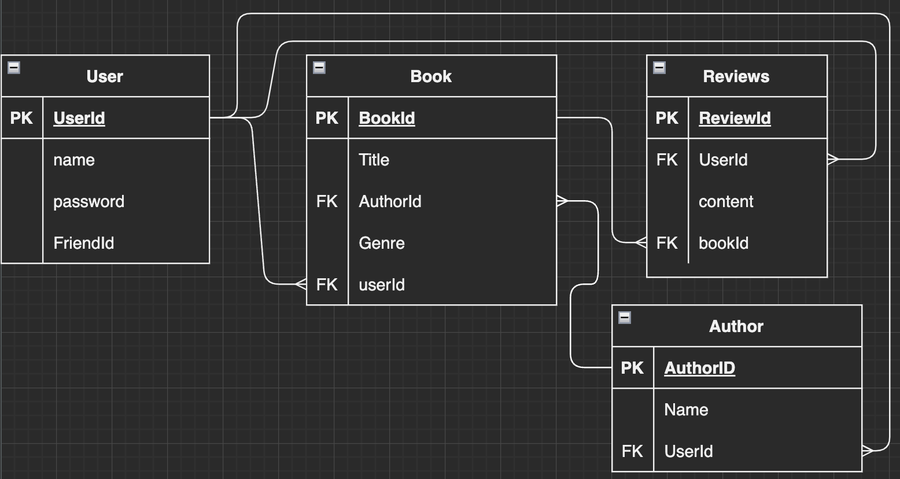
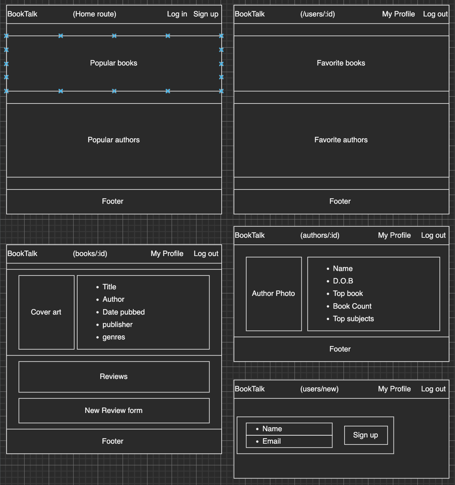

# BookTalk

## Welcome to your new social hub for all things books!

[live deployment](booktalk-waltersmatthew.koyeb.app)
---
* Add your favorite books, authors, and genres to your profile
* View book details from your profile
* Leave reviews on books for all to see
---
I will be using the [Open Library](https://openlibrary.org) API to populate all data and render the JSON into a simple, easy to read format. 

### proof of concept on API
JSON results 
  
Cover art results  
  
Author photo results  

---

### ERDs

---
 
---
### Restful routing chart
---
READ /books/results -- show search results
READ /books/results/:id -- show single book result

READ /authors/results --show search results
READ /authors/results/:id -- show single author result

CREATE /books/:bookId --leave a review  
CREATE /users/new --make new user
CREATE /users/profile --Make new author/book fave

READ / -- show home page with login/signup 
READ /users/profile-- show the signed in user's profile and faved books/authors 
READ /users/search -- call api to search list of book/author results 

UPDATE /books/:bookId -- edit a review

DESTROY /users/:userId -- delete fave books/authors 

---
### Wireframe
---
  

---
### User stories
---

* As a user, I want to search for books

* As a user, I want to read details about new books

* As a user, I want to add books to my favorites list in my profile

* As a user, I want to learn more about authors

* As a user, I want to add favorite authors to my profile

* As a user, I want to leave reviews on books I've read

---

### MVP goals

* Query API and render results on page when searched
* sign up and log in users with unique usernames
* Add books to favorites in profile
* Delete books in profile
* Leave reviews on books
* Edit reviews

### Stretch goals

* Add authors to favorites in profiles
* Delete authors in profile
* 0-5 ratings on favorited books in profile
* View all profiles
* Add profiles to friends
* View subjects
* Radio buttons to search by author, title, or subject

